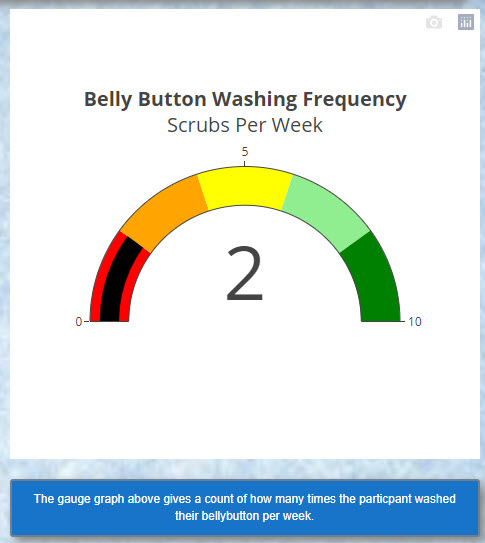

# Plotly Belly Button Biodiversity Project

## Overview of the Project

Roza is a biological research in a microbiological laboratory. In her role, she is tasked with studying bacterial species to determine if there are any bacterial species that might be used to synthesize proteins that taste like beef. Her lab has partnered with Improbably Beef to study bacteria in order to develop plant-based proteins as alternatives to meat. Roza's hypothesis is that there is a microorganism found in the bellybutton that could be used to synthesize these proteins. Roza has sampled the navels of people across the country and collected data on the individuals and the samples. This project will use data visualization tools to display the data collected.

## Tools Used

- JavaScript
- HTML/CSS
- Visual Studio Code v1.62.3
- Plotly
- Bootstrap

## Results

### Demographic Info

The demographics panel was created using several different JavaScript functions and methods (see Methods Used below). The Demographic Info panel is populated with the ID numbers of the various participants. When a different ID number is chosen, the demographic information in the panel is changed, as is the data in the three graphs.

#### Methods Used

- JavaScript functions and methods: map(), filter(), reverse(), and slice()
- Filtered arrays
- Load JSON file with d3.json()
- Function to read in json data
- ID number code create to use on information on panels and charts

***

### Horizontal Bar Chart

The horizontal bar chart was created using JavaScript, Plotly, and D3.js. It displays the top 10 bacterial cultures (OTUs) for a specific individual's ID that were found in their navel.The OTU labels are also displayed as hover text for the bars on the chart. 

- Plotly bar chart
- Filtered arrays
- Function to create a chart 

***

### Bubble Chart

The bubble chart displays the details of the bacteria that were found in the participant's belly button. The size and the color of the bubbles are related to the quantity of a specific bacterial culture taken from the navel of the participant. The greater the number of a specific bacteria, the larger the bubble. The lighter the color of a bubble is also an indicator of a greater number of a specific bacteria. The OTU labels are displayed as hover text for the bubbles on the chart.

- Plotly bubble chart
- Filtered arrays
- Function to create a chart

***

### Gauge Chart

The gauge chart displays the count of the number of times an individual washes their belly button and eradicates the bacterial cultures. The top ten results are displayed; therefore, the chart has a maximum of ten results.

- Plotly gauge chart
- Filtered arrays
- Function to create chart

***

### HTML/CSS Elements

The index.html and style.css files were altered to make a more appealing visual display.

- A background image was added to the Jumbotron and to the page.
- Text was added under each graph to explain details about the graph.
- The text boxes include a fill, borders, rounded corners and a drop shadow.
- The font on the text boxes is decreased to 85%.
- The Jumbotron includes a drop shadow.

***

## Summary
The outcome of the biodiversity project was not provided, so we do not know whether bacteria from belly buttons will assist in synthesizing proteins to taste like beef. The visualization has provided Roza with the ability to move forward with her research.

***

View website below:

<a href="https://vickycarlson.github.io/BellyB/" target="blank">Belly Button Biodiversity Dashboard</a>
This website is best viewed in Microsoft Edge.